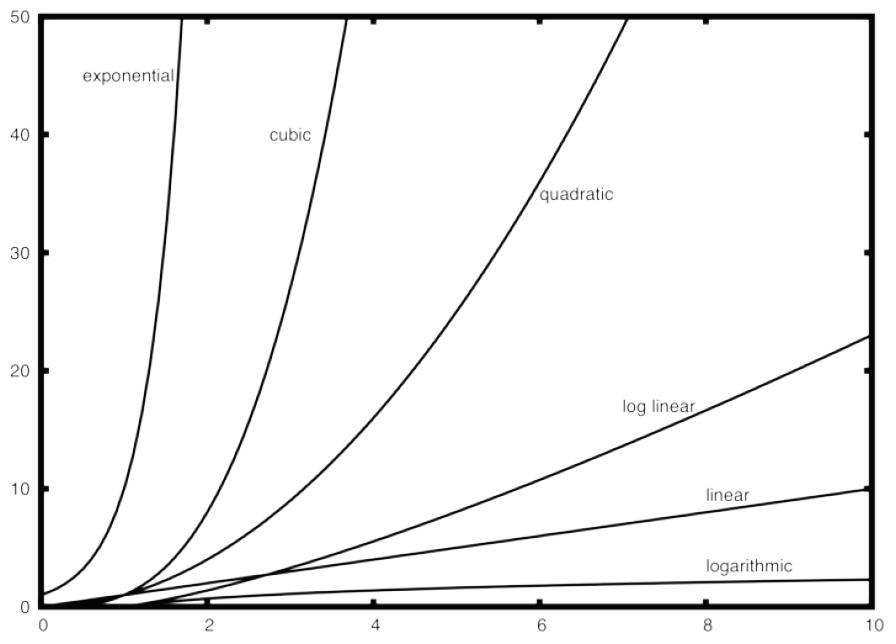
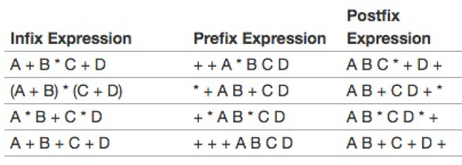
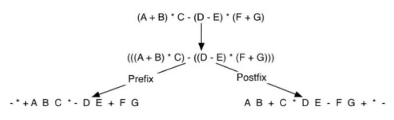
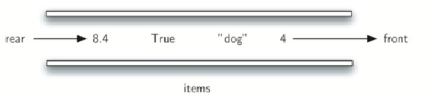
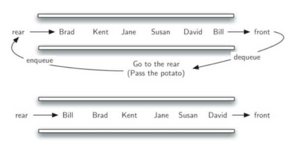
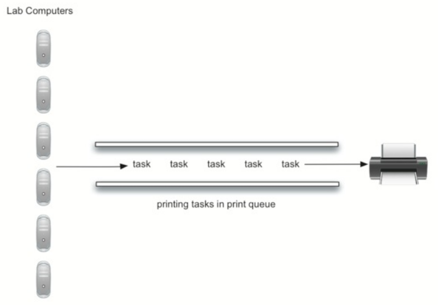

[TOC]

1. 测量函数的执行时间：
   1. 使用`time`函数：他可以在任意被调用的地方返回系统时钟的当前时间（以秒为单位）。

   2. 可以通过在开始和结束的时候分别调用两次`time`函数，然后计算差异，就可以得到一个函数执行花费的精确秒数。

   3. 使用 Python 的 timeit 模块。timeit 模块旨在
      允许 Python 开发人员通过在一致的环境中运行函数并使用尽可能相似的操作系统的时序机制
      来进行跨平台时序测量。
      要使用 timeit，你需要创建一个 Timer 对象，其参数是两个 Python 语句。第一个参数是一个
      你想要执行时间的 Python 语句; 第二个参数是一个将运行一次以设置测试的语句。然后 timeit
      模块将计算执行语句所需的时间。

   4. 时间复杂度比较T(n)：  

   

## 列表：  

1. 常见的操作是**索引**和**分配到索引位置**。无论列表有多大，这两个操作 都需要相同的时间，当操作与列表的大小无关时，复杂度为：$O(1)$ 。
2. 另一个常见的任务是**增加一个列表**。
   1. 使用`append` ：$O(1)$
   2. 拼接运算符：$O(k)$ ，k为要拼接的列表的大小。

## 栈：  

1. **后进先出**：添加和移项总发生在同一端。这一端通常称为“顶部”，与之对应的称为“底部”。在栈中靠近底部的项是存储时间最长的。最近添加的项是最先会被移除的。》》LIFO。
2. 栈的抽象数据类型由以下结构和操作定义。栈被构造为项的有序集合，其中项被
   添加和从末端移除的位置称为“顶部”。栈是有序的 LIFO 。栈操作如下。
   * Stack() 创建一个空的新栈。 它不需要参数，并返回一个空栈。
   * push(item)将一个新项添加到栈的顶部。它需要 item 做参数并不返回任何内容。
   * pop() 从栈中删除顶部项。它不需要参数并返回 item 。栈被修改。
   * peek() 从栈返回顶部项，但不会删除它。不需要参数。 不修改栈。
   * isEmpty() 测试栈是否为空。不需要参数，并返回布尔值。
   * size() 返回栈中的 item 数量。不需要参数，并返回一个整数。

### 匹配括号：  

从空栈开始，从左到右处理
括号字符串。如果一个符号是一个开始符号，将其作为一个信号，对应的结束符号稍后会出
现。另一方面，如果符号是结束符号，弹出栈，只要弹出栈的开始符号可以匹配每个结束符
号，则括号保持匹配状态。如果任何时候栈上没有出现符合开始符号的结束符号，则字符串
不匹配。最后，当所有符号都被处理后，栈应该是空的。

```python
from pythonds.basic.stack import Stack

def parChecker(symbolString):
	s = Stack()
	balanced = True
	index = 0
    #设置标记balanced来作为判断标志。如果在没有遍历完整个字符串前，栈已经为空了，说明括号不匹配，可以提前结束判断。
	while index < len(symbolString) and balanced:
		symbol = symbolString[index]
		if symbol == "(":
			s.push(symbol)
		else:
			if s.isEmpty():
			balanced = False
		else:
			s.pop()
		index = index + 1
	if balanced and s.isEmpty():
		return True
	else:
		return False
```

不同符号之间的匹配：  

```python
from pythonds.basic.stack import Stack

def parChecker(symbolString):
	s = Stack()
	balanced = True
	index = 0
	while index < len(symbolString) and balanced:
		symbol = symbolString[index]
		if symbol in "([{":
			s.push(symbol)
		else:
			if s.isEmpty():
				balanced = False
			else:
				top = s.pop()
				if not matches(top,symbol):
					balanced = False
			index = index + 1
	if balanced and s.isEmpty():
		return True
	else:
		return False
def matches(open,close):
	opens = "([{"
	closers = ")]}"
	return opens.index(open) == closers.index(close)
```

### 十进制转二进制：  

“除 2”算法，它用栈来跟踪二进制结果的数字。
“除 2” 算法假定我们从大于 0 的整数开始。不断迭代的将十进制除以 2，并跟踪余数。第一个
除以 2 的余数说明了这个值是偶数还是奇数。偶数有 0 的余数，记为 0。奇数有余数 1，记为
1.我们将得到的二进制构建为数字序列，第一个余数实际上是序列中的最后一个数字。

```python
from pythonds.basic.stack import Stack

def divideBy2(decNumber):
	remstack = Stack()
	while decNumber > 0:
		rem = decNumber % 2
		remstack.push(rem)
		decNumber = decNumber // 2
	binString = ""
	while not remstack.isEmpty():
		binString = binString + str(remstack.pop())
	return binString
print(divideBy2(42))
```

可以修改 divideBy2 函数，使它不仅能接受十进制参数，还能接受预期转换的基数。‘除 2’ 的
概念被简单的替换成更通用的 ‘除基数’。采用十进制数和 2 到 16 之间的任何基数作为参数。余数部分仍然入栈，直到被转换的值为 0。

```python
from pythonds.basic.stack import Stack
def baseConverter(decNumber,base):
	digits = "0123456789ABCDEF"
	remstack = Stack()
	while decNumber > 0:
		rem = decNumber % base
		remstack.push(rem)
		decNumber = decNumber // base
	newString = ""
	while not remstack.isEmpty():
		newString = newString + digits[remstack.pop()]
	return newString
```

### 中缀前缀和后缀表达式：  

中缀表达式要求运算符在他需要处理的两个操作数之间。前缀表达式符号要求所有运算符在它们处理的两个操作数之前。另一个方面，后缀要求其操作符在相应的操作数之后。



(A + B) * C - (D - E) * (F + G)转换为后缀和前缀：



#### 中缀转后缀通用法：  

假设中缀表达式是一个由空格分隔的标记字符串。 操作符标记是 *，/，+ 和 - ，以及左右括
号。操作数是单字符 A，B，C 等。 以下步骤将后缀顺序生成一个字符串。

1. 创建一个名为 opstack 的空栈以保存运算符。给输出创建一个空列表。
2. 通过使用字符串方法拆分将输入的中缀字符串转换为标记列表。
3. 从左到右扫描标记列表。
  * 如果标记是操作数，将其附加到输出列表的末尾。
  * 如果标记是左括号，将其压到 opstack 上。
  * 如果标记是右括号，则弹出 opstack，直到删除相应的左括号。将每个运算符附加到输出列表的末尾。
  * 如果标记是运算符， *，/，+ 或 - ，将其压入 opstack。但是，首先删除已经在opstack 中具有更高或相等优先级的任何运算符，并将它们加到输出列表中。
4. 当输入表达式被完全处理时，检查 opstack。仍然在栈上的任何运算符都可以删除并加到输出列表的末尾。

> 可以使用一个字典来保存操作符的优先级。将每一个运算符映射到一个整数，可以与其他运算符的优先级进行比较。左括号将赋予最低的值。

```python
from pythonds.basic.stack import Stack
def infixToPostfix(infixexpr):
	prec = {}
	prec["*"] = 3
	prec["/"] = 3
	prec["+"] = 2
	prec["-"] = 2
	prec["("] = 1
	opStack = Stack()
	postfixList = []
	tokenList = infixexpr.split()
    
for token in tokenList:
	if token in "ABCDEFGHIJKLMNOPQRSTUVWXYZ" or token in "0123456789":
		postfixList.append(token)
	elif token == '(':
		opStack.push(token)
	elif token == ')':
		topToken = opStack.pop()
		while topToken != '(':
			postfixList.append(topToken)
			topToken = opStack.pop()
	else:
		while (not opStack.isEmpty()) and \
			(prec[opStack.peek()] >= prec[token]):
				postfixList.append(opStack.pop())
		opStack.push(token)
while not opStack.isEmpty():
	postfixList.append(opStack.pop())
return " ".join(postfixList)
```

#### 后缀表达式求值：  

考虑后缀表达式 4 5 6 * + ， 首先遇到操作数 4 和 5 ，此时，你还不确定如何处理它们，直到看到下一个符号。将它们放置到栈上，确保它们在下一个操作符出现时可用。
在这种情况下，下一个符号是另一个操作数。所以，像先前一样，压入栈中。并检查下一个符号。现在我们看到了操作符 * ，这意味着需要将两个最近的操作数相乘。通过弹出栈两次，我们可以得到正确的两个操作数，然后执行乘法。  

假设后缀表达式是一个由空格分隔的标记字符串。 运算符为 *，/，+ 和 - ，操作数假定为单
个整数值。 输出将是一个整数结果。

1. 创建一个名为 operandStack 的空栈。
2. 拆分字符串转换为标记列表。
3. 从左到右扫描标记列表。
  * 如果标记是操作数，将其从字符串转换为整数，并将值压到operandStack。
  * 如果标记是运算符 *，/，+ 或 - ，它将需要两个操作数。弹出operandStack 两次。第一个弹出的是第二个操作数，第二个弹出的是第一个操作数。执行算术运算后，将结果压到操作数栈中。
4. 当输入的表达式被完全处理后，结果就在栈上，弹出 operandStack 并返回值。

```python
from pythonds.basic.stack import Stack
def postfixEval(postfixExpr):
operandStack = Stack()
tokenList = postfixExpr.split()
for token in tokenList:
if token in "0123456789":
operandStack.push(int(token))
else:
operand2 = operandStack.pop()
operand1 = operandStack.pop()
result = doMath(token,operand1,operand2)
operandStack.push(result)
return operandStack.pop()
def doMath(op, op1, op2):
if op == "*":
return op1 * op2
elif op == "/":
return op1 / op2
elif op == "+":
return op1 + op2
else:
return op1 - op2
print(postfixEval('7 8 + 3 2 + /'))
```


## 队列：    

队列是项的有序结合，添加新项的一端称为**队尾**，移除项的一端称为**队首** 。

当一个元素从队尾进入队列时，一直向队首移动，直到他成为下一个需要移除的元素为止。

最近添加的元素必须在队尾等待。**集合中存活时间最长的元素在队首，这种排序称为*FIFO*，先进先出**。



### 队列抽象数据类型  

主要的操作如下：  

* `Queue()` ：创建一个空的新队列。不需要参数，病返回一个空队列。
* `enqueue(item)` ：将新项添加到队尾。需要`item`做参数，病不返回任何内容。
* `dequeue()` ：从对首移除项。他不需要参数病返回`item` 。队列被修改。
* `isEmpty()` ：查看队列是否为空。他不需要参数，并返回一个整数。
* `size()` ：返回队列中的项数。他不需要参数，并返回一个整数。

### python实现  

使用**列表**来来作为构建队列的内部表示。  

* 假设列表的队尾在列表中的位置为0,。这允许我们使用列表上的插入函数向队尾添加新元素。弹出操作可以用于删除队首元素。

* 这意味着入队为`O(n)` ：因为需要将已经在队列中的元素向后移动`n` 个位置。

* 而出队为`O(1)` ：因为出队直接在列表末尾直接删除元素。  

  ```python
  class	Queue:
  				def	__init__(self):
  								self.items	=	[]
  				def	isEmpty(self):
  								return	self.items	==	[]
  				def	enqueue(self,	item):
  								self.items.insert(0,item)
  				def	dequeue(self):
  								return	self.items.pop()
  				def	size(self):
  								return	len(self.items)
  ```

### 模拟：烫手洋芋  

将孩子们围成一个圈，并尽可能快的将一个山芋递给旁边的孩子。在某一个时间，动作结束，有山芋的孩子从圈中移除。游戏继续开始直到剩下最后一个孩子。  


*输入* :名称列表和一个称为`num` 常量用于报数。

*输出* :返回以`num` 为单位重复报数后剩余的最后一个人的姓名。

**思想：使用队列，初始化为拿着山芋的孩子在队列的最前面，也就是队首，其他孩子一次排列在队列中。拿到山芋的孩子先出列再入队列到队列的队尾。这样经过`num` 次的出队入队后，队首的孩子即为将被淘汰的孩子，永久的移除队列。并重新开始这个过程，直到只剩下一个孩子（即队列大小为1）。**  



```python
from	pythonds.basic.queue	import	Queue
def	hotPotato(namelist,	num):
				simqueue	=	Queue()
				for	name	in	namelist:
								simqueue.enqueue(name)
				while	simqueue.size()	>	1:
								for	i	in	range(num):
												simqueue.enqueue(simqueue.dequeue())
								simqueue.dequeue()
				return	simqueue.dequeue()
print(hotPotato(["Bill","David","Susan","Jane","Kent","Brad"],7))
```

在这里会发现`num` 的值大于列表中的名称数。但是在python中这不是一个问题。他会回到列表的开始计数，直到达到计数值。

### 模拟：打印机  

平均每天大约10名学生在任何给定时间在实验室工作。这些学生通常在此期间打印两次,这些任务的长度范围从1到20页。实验室中的打印机较旧,每分钟以草稿质量可以处理10页。打印机可以切换以提供更好的质量,但是它将每分钟只能处理五页。较慢的打印速度可能会使学生等待太久。应使用什么页面速率?

将需要为学生,打印任务和打印机构建表现表示。当学生提交打印任务时,我们将把他们添加到等待列表中,一个打印任务的队列。	当打印机完成任务时,它将检查队列,以检查是否有剩余的任务要处理。我们感兴趣的是学生等待他们的论文打印的平均时间。这等于任务在队列中等待的平均时间量。



需要使用一些概率。例如,学生可以打印长度从	1	到	20	页的纸张。如果从	1	到	20	的每个长度有同样的可能性,则可以通过使用	1	和	20	之间的随机数来模拟打印任务的实际长度。这意味着出现从	1	到	20	的任何长度的机会是平等的。

如果实验室中有	10	个学生,每人打印两次,则平均每小时有	20	个打印任务。	在任何给定的秒,打印任务将被创建的机会是什么?	回答这个问题的方法是考虑任务与时间的比率。每小
时	20	个任务意味着平均每	180	秒将有一个任务。

#### 主要模拟步骤：   

1. 创建打印任务的队列，每个任务都有个时间戳。队列启动时为空。
2. 每秒（currentSecond）：
   1. 是否有新的打印任务？如果是，将`currentSecond` 作为时间戳添加到队列。
   2. 如果打印机不忙并且有任务在等待：
      1. 从打印机队列中删除一个任务并将其分配给打印机。
      2. 从`currentSecond` 中减去时间戳，以计算该任务的等待时间。
      3. 将该任务的等待时间附件到列表中稍后处理。
      4. 根据打印任务的页数，确定需要多少时间。
   3. 打印机需要一秒打印，所以得从该任务的所需的等待时间减去一秒。
   4. 如果任务已经完成，也就是所需的时间已经达到零，打印机空闲。
3. 模拟完成后，从生成的等待时间列表中计算平均等待时间。

